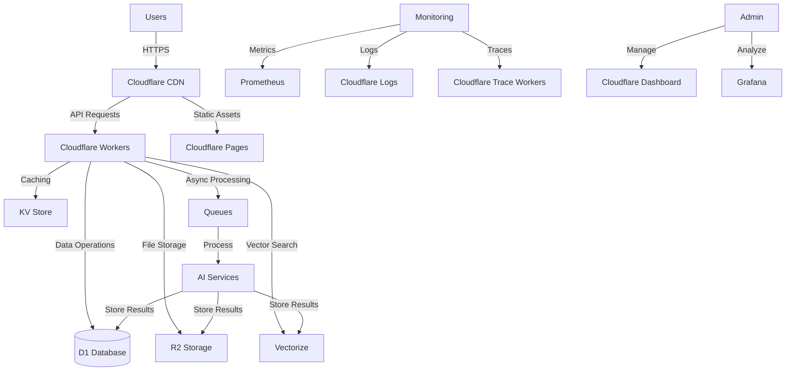

# OpenDiscourse Infrastructure Guide

This document provides a comprehensive overview of the OpenDiscourse infrastructure, including architecture, services, and management procedures.

## Architecture Overview

OpenDiscourse is built on a modern, cloud-native architecture using Cloudflare's suite of services and containerized microservices. The architecture is designed for scalability, reliability, and maintainability.

### Core Components

1. **Frontend**: React-based web application served via Cloudflare Pages
2. **API Layer**: Cloudflare Workers and FastAPI services
3. **Data Storage**:
   - D1 (SQLite) for relational data
   - R2 for document storage
   - Vectorize for embeddings and semantic search
   - KV for caching and session storage
4. **AI/ML Services**:
   - Workers AI for model inference
   - Custom AI services for document processing
5. **Message Queues**: Cloudflare Queues for async processing
6. **Monitoring**: Grafana, Prometheus, and Cloudflare Analytics

## Infrastructure as Code

The infrastructure is defined using:

- **Terraform**: For provisioning and managing Cloudflare resources
- **Docker Compose**: For local development and testing
- **GitHub Actions**: For CI/CD pipelines

## Deployment Topology

## Service Dependencies

| Service | Depends On | Description |
|---------|------------|-------------|
| Frontend | - | Static web application |
| API Workers | D1, R2, KV, Vectorize | Core application logic |
| Document Processor | R2, Queues | Handles document ingestion |
| AI Services | Workers AI, Queues | Runs AI/ML models |
| Monitoring | Prometheus, Grafana | Observability stack |

## Scaling Considerations

### Horizontal Scaling
- Workers automatically scale based on incoming requests
- D1 supports read replicas for read-heavy workloads
- R2 scales storage and bandwidth automatically

### Vertical Scaling
- Worker CPU and memory can be increased via Cloudflare settings
- D1 performance scales with the Cloudflare global network

### Performance Optimization
- Edge caching with Cloudflare CDN
- Intelligent routing to nearest data center
- Automatic image optimization

## Security Considerations

### Data Protection
- All data encrypted at rest and in transit
- Role-based access control (RBAC) for all services
- Regular security audits and penetration testing

### Access Control
- OAuth 2.0 and API key authentication
- IP allowlisting for administrative access
- Audit logging for all administrative actions

## Monitoring and Alerting

### Metrics Collection
- Request/response times
- Error rates
- Resource utilization
- Custom business metrics

### Alerting
- Real-time alerts for critical issues
- Daily/weekly reports
- On-call rotation for production incidents

## Backup and Recovery

### Data Backup
- Automated daily backups of D1 databases
- Versioning enabled on R2 buckets
- Point-in-time recovery for critical data

### Disaster Recovery
- Multi-region failover configuration
- Automated recovery procedures
- Regular disaster recovery testing

## Maintenance Procedures

### Regular Maintenance
- Weekly system updates
- Monthly security patches
- Quarterly architecture reviews

### Upgrade Procedures
1. Test in staging environment
2. Create backup of production data
3. Deploy changes during low-traffic periods
4. Monitor system health post-deployment
5. Rollback plan in place

## Cost Management

### Cost Optimization
- Monitor resource utilization
- Right-size services based on demand
- Use reserved capacity for predictable workloads

### Budgeting
- Monthly cost allocation by team
- Alerting for unexpected cost increases
- Regular cost optimization reviews

## Compliance and Governance

### Regulatory Compliance
- GDPR compliance for user data
- Data retention policies
- Audit logging for compliance requirements

### Change Management
- All changes require code review
- Deployment approvals for production
- Rollback procedures for all deployments

## Troubleshooting

### Common Issues
1. **API Timeouts**
   - Check worker timeouts
   - Verify database connection limits
   - Monitor queue backlogs

2. **Authentication Failures**
   - Verify API keys and tokens
   - Check OAuth provider status
   - Review access logs

3. **Performance Degradation**
   - Check resource utilization
   - Review recent deployments
   - Analyze query performance

### Support Channels
- 24/7 on-call support for critical issues
- Business hours support for non-critical issues
- Community forum for questions and discussions

## Contact Information

For infrastructure support, contact:
- **Email**: infrastructure@opendiscourse.net
- **Slack**: #infra-support channel
- **Emergency Pager**: +1-XXX-XXX-XXXX

## Changelog

### 2024-03-15
- Initial infrastructure documentation
- Added architecture diagrams
- Documented deployment procedures

### 2024-03-10
- Initial infrastructure setup
- Basic monitoring configuration
- CI/CD pipeline implementation
