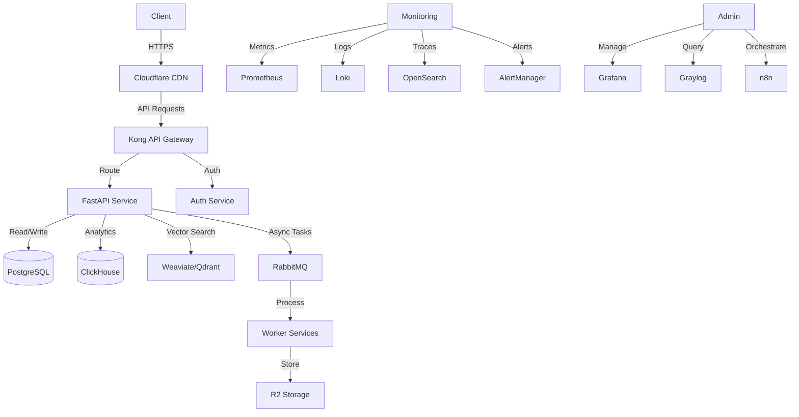

# OpenDiscourse Infrastructure

This directory contains the infrastructure as code for the OpenDiscourse platform, including Docker Compose configurations, deployment scripts, and monitoring setups.

## Prerequisites

- Docker and Docker Compose
- Node.js and npm
- Cloudflare Wrangler CLI (`npm install -g wrangler`)
- Cloudflare account with appropriate permissions

## Directory Structure

```
infrastructure/
├── cloudflare/         # Cloudflare-specific configurations
├── databases/          # Database initialization scripts
├── monitoring/         # Monitoring stack configurations
│   ├── prometheus/     # Prometheus configuration
│   └── grafana/        # Grafana dashboards and provisioning
├── networking/         # Network configurations
├── scripts/            # Utility scripts
├── config.yaml         # Main configuration
├── docker-compose.yml  # Docker Compose configuration
├── setup.sh           # Initial setup script
└── deploy.sh          # Deployment script
```

## Getting Started

### 1. Initial Setup

1. Clone the repository:
   ```bash
   git clone https://github.com/yourusername/opendiscourse.net-cf.git
   cd opendiscourse.net-cf/infrastructure
   ```

2. Run the setup script to generate configuration files and environment variables:
   ```bash
   chmod +x setup.sh
   ./setup.sh
   ```

3. Review and update the generated `.env` file in the project root with any required values.

### 2. Local Development

To start the local development environment:

```bash
docker-compose up -d
```

This will start all the required services including:
- PostgreSQL with pgvector
- ClickHouse
- Weaviate
- Qdrant
- RabbitMQ
- Monitoring stack (Prometheus, Grafana, Loki, OpenSearch, Graylog)
- Kong API Gateway
- FastAPI service

### 3. Deploy to Cloudflare

1. Ensure you're logged in to Cloudflare:
   ```bash
   wrangler login
   ```

2. Run the deployment script:
   ```bash
   chmod +x deploy.sh
   ./deploy.sh
   ```

This will deploy:
- Cloudflare Workers
- D1 Databases
- R2 Storage Buckets
- Vectorize Indexes
- Queues
- DNS Records

## Monitoring

Access the monitoring dashboards:

- **Grafana**: http://localhost:3000 (admin/admin)
- **Prometheus**: http://localhost:9090
- **Loki**: http://localhost:3100
- **OpenSearch**: http://localhost:9200
- **Graylog**: http://localhost:9000 (admin/admin)
- **Kong Admin**: http://localhost:8001
- **RabbitMQ Management**: http://localhost:15672 (guest/guest)

## Services

### Core Services

- **API**: FastAPI service running on port 8000
- **PostgreSQL**: Primary database with pgvector extension
- **ClickHouse**: Analytics database
- **Weaviate/Qdrant**: Vector databases for semantic search
- **RabbitMQ**: Message broker for async processing

### AI/ML Services

- **LocalAI**: Local LLM inference
- **OpenWebUI**: Web interface for LLMs
- **Flowise**: Visual LLM workflow builder
- **n8n**: Workflow automation

### Monitoring Stack

- **Prometheus**: Metrics collection
- **Grafana**: Visualization and dashboards
- **Loki**: Log aggregation
- **OpenSearch**: Search and analytics
- **Graylog**: Log management

## Configuration

### Environment Variables

Key environment variables (stored in `.env`):

```
# Database
POSTGRES_USER=postgres
POSTGRES_PASSWORD=generated_password
POSTGRES_DB=opendiscourse
CLICKHOUSE_USER=default
CLICKHOUSE_PASSWORD=generated_password
CLICKHOUSE_DB=opendiscourse

# Message Broker
RABBITMQ_DEFAULT_USER=guest
RABBITMQ_DEFAULT_PASS=generated_password

# Authentication
JWT_SECRET=generated_secret

# Cloudflare
CLOUDFLARE_ACCOUNT_ID=your_account_id
CLOUDFLARE_API_TOKEN=your_api_token
CLOUDFLARE_ZONE_ID=your_zone_id
```

## Deployment Architecture



## Troubleshooting

### Common Issues

1. **Port Conflicts**: Ensure no other services are using the default ports (check `docker-compose.yml`).
2. **Missing Environment Variables**: Verify all required variables are set in `.env`.
3. **Docker Resource Limits**: Allocate sufficient CPU/Memory to Docker if services fail to start.

### Logs

View logs for all services:
```bash
docker-compose logs -f
```

View logs for a specific service:
```bash
docker-compose logs -f service_name
```

## License

This project is licensed under the MIT License - see the [LICENSE](../LICENSE) file for details.
